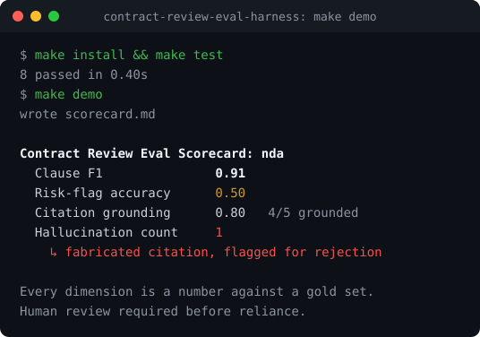

# Sebastian Förste

I build **review-gated legal AI systems**: evaluation harnesses, supervised workflows, and legal operating layers that make outputs cited, testable, and safe for human approval.

German-qualified lawyer, former NLP data scientist, and partner at gunnercooke. My work sits between legal engineering, product engineering, and AI governance: structured intake, deterministic checks, visible source provenance, human-approved outputs, and audit trails.

I work across EU regulation, MiCAR, the EU AI Act, DORA, and GDPR. The regulatory checks below cite primary EU law: the MiCAR whitepaper linter encodes 35 disclosure rules across Annexes I, II and III with stable rule IDs and pinpoint citations, and the EU AI Act classifier runs statutory gates from Art. 5 EU AI Act prohibitions through GPAI obligations.

These are public-safe prototypes on synthetic data only. 

## Start here

If you look at one repository, look at **[`contract-review-eval-harness`](https://github.com/sebastianfoerste/contract-review-eval-harness)**: an offline, deterministic evaluation harness for AI contract review. It scores model output against a hand-authored answer set and catches **missed clauses, wrong risk severity, unsupported citations, and fabricated text.**

```bash
git clone https://github.com/sebastianfoerste/contract-review-eval-harness
cd contract-review-eval-harness && make install && make test && make demo
```



In the sample run it catches a fabricated citation and marks the output for rejection. The thesis: **legal AI quality should be measured, not asserted.** A second idea runs alongside it: legal AI becomes useful when judgment is *structured before* the model acts, *measured after* it acts, and *blocked until* a human approves consequential use.

## Portfolio map

| Layer | The question it answers | Repository |
| --- | --- | --- |
| **Evaluation** | How do we know the legal AI output is any good? | `contract-review-eval-harness` |
| **Supervised workflow** | How do we keep agentic legal work accountable? | `legal-ops-agent` |
| **Legal operating layer** | How does a GC scale intake, routing, approvals, and reporting? | `ai-saas-legal-ops-starter-kit`, `legal-function-operating-system` |
| **Privacy and domain checks** | Can regulation become cited, reviewable first-pass checks? | `dpa-and-data-transfer-review`, `eu-ai-act-classifier`, `micar-whitepaper-linter`, `MiCAR-Authorization-Co-Pilot`, `eu-financial-reg-horizon-scanner`, `dora-third-party-register-and-resilience-workbench` |
| **Adoption** | How does legal AI move from demo to daily use? | `legal-ai-adoption-dashboard`, `legal-ai-workshop-kit` |

## How I think about legal AI

Useful legal AI starts with controlled legal work. The questions I build around: is intake structured before drafting begins? Are assumptions, sources, and gaps visible? Can a user see what is draft, checked, approved, or blocked? Can quality be tested before it is asserted? Can the workflow make a lawyer faster while preserving judgment? That is why these projects lean on deterministic checks, evaluation scripts, explicit review states, blocked exports, audit trails and structured prompts.

## Background

Partner at gunnercooke in Germany, advising on AI, SaaS, crypto, capital markets, payments, and EU financial regulation. German-qualified lawyer, admitted 2012; trained at Hengeler Mueller, Freshfields Bruckhaus Deringer, and Cleary Gottlieb. Earlier, data scientist at Dudenverlag building Python NLP pipelines.

## Contact

[LinkedIn](https://www.linkedin.com/in/sebastianfoerste)
